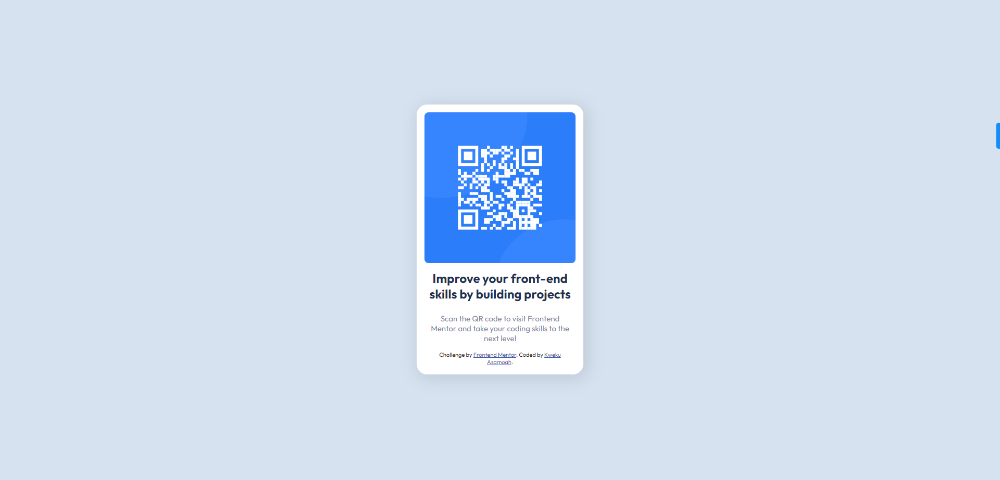

# Frontend Mentor - QR code component solution

This is a solution to the [QR code component challenge on Frontend Mentor](https://www.frontendmentor.io/challenges/qr-code-component-iux_sIO_H). Frontend Mentor challenges help you improve your coding skills by building realistic projects.

## Table of contents

- [Overview](#overview)
  - [Screenshot](#screenshot)
  - [Links](#links)
- [My process](#my-process)
  - [Built with](#built-with)
  - [What I learned](#what-i-learned)
  - [Continued development](#continued-development)
  - [Useful resources](#useful-resources)
- [Author](#author)

## Overview

This is a solution to a Card challenge from Frontend Mentor.

### Screenshot



### Links

- Solution URL: [QR-Code-Component](https://github.com/kwekuduahh/QR-Code-Component)
- Live Site URL: [QR-Code-Component](https://qr-codecomponent-challenge.netlify.app/)

## My process

I started by building the blocks in HTML before proceeding to CSS styles. I think this was a pretty simple and straightforward challenge, and I look forward to more engaging ones.

### Built with

- Semantic HTML5 markup
- CSS custom properties
- Flexbox

### What I learned

I particularly was proud of how I applied semantic HTML in my project to make it accessible to screen readers. This promoted accessibility in my project. I also enjoyed the processing of strategising
an approach to build a div that wrapped around it's contents. This was an exciting experience and I will keep attempting more challenges.

I have shared snippets of the code I used to achieve that below;

```html
<main>
	<section id="image-section">
		<figure>
			
		</figure>
	</section>
	<section id="description-section">
		<header>
			<h2>Improve your front-end skills by building projects</h2>
		</header>
		<p>
			Scan the QR code to visit Frontend Mentor and take your coding skills to the
			next level
		</p>

		<div class="attribution">
			Challenge by
			<a
				href="https://www.frontendmentor.io?ref=challenge"
				target="_blank"
				>Frontend Mentor</a
			>. Coded by <a href="https://github.com/kwekuduahh">Kweku Asamoah</a>.
		</div>
	</section>
</main>
```

```css
main {
	background-color: hsl(0, 0%, 100%);
	display: flex;
	flex-direction: column;
	align-items: center;
	width: fit-content;
	text-align: center;
	padding: 15px;
	border-radius: 20px;
	box-shadow: 5px 5px 30px 5px rgba(0, 0, 0, 0.1);
}
```

### Continued development

I look forward to practising how to use clamps instead of media queries. Also, building react components similar to design components.

## Author

- Website - [kweku Asamoah](https://kweku-asamoah.webflow.io)
- Frontend Mentor - [@kwekudauhh](https://www.frontendmentor.io/profile/kwekuduahh)
- Twitter - [@kwekuduahh](https://www.twitter.com/kwekuduahh)
